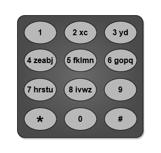

3016. Minimum Number of Pushes to Type Word II

Example 1:

Input: word = "abcde"
Output: 5
Explanation: The remapped keypad given in the image provides the minimum cost.
"a" -> one push on key 2
"b" -> one push on key 3
"c" -> one push on key 4
"d" -> one push on key 5
"e" -> one push on key 6
Total cost is 1 + 1 + 1 + 1 + 1 = 5.
It can be shown that no other mapping can provide a lower cost.

Example 2:

Input: word = "xyzxyzxyzxyz"
Output: 12
Explanation: The remapped keypad given in the image provides the minimum cost.
"x" -> one push on key 2
"y" -> one push on key 3
"z" -> one push on key 4
Total cost is 1 * 4 + 1 * 4 + 1 * 4 = 12
It can be shown that no other mapping can provide a lower cost.
Note that the key 9 is not mapped to any letter: it is not necessary to map letters to every key, but to map all the letters.
Example 3:

Input: word = "aabbccddeeffgghhiiiiii"
Output: 24
Explanation: The remapped keypad given in the image provides the minimum cost.
"a" -> one push on key 2
"b" -> one push on key 3
"c" -> one push on key 4
"d" -> one push on key 5
"e" -> one push on key 6
"f" -> one push on key 7
"g" -> one push on key 8
"h" -> two pushes on key 9
"i" -> one push on key 9
Total cost is 1 * 2 + 1 * 2 + 1 * 2 + 1 * 2 + 1 * 2 + 1 * 2 + 1 * 2 + 2 * 2 + 6 * 1 = 24.
It can be shown that no other mapping can provide a lower cost.

Two Solutions Provided
    Both the solutions are be used
    simple -> easy to understand, beats 100%
    updated -> removed storing of sorted values, beats 100%

Logic:
    1. Find the frequency of each character in the word.
    2. Sort the frequency in descending.
    3. Sum the clicks, as only 8 nums are present (index)/8 (nums start from 2 to 9 so (+1))