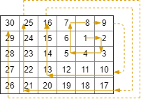

885. Spiral Matrix III

Example 1:

Input: rows = 1, cols = 4, rStart = 0, cStart = 0
Output: [[0,0],[0,1],[0,2],[0,3]]

Example 2:

Input: rows = 5, cols = 6, rStart = 1, cStart = 4
Output: [[1,4],[1,5],[2,5],[2,4],[2,3],[1,3],[0,3],[0,4],[0,5],[3,5],[3,4],[3,3],[3,2],[2,2],[1,2],[0,2],[4,5],[4,4],[4,3],[4,2],[4,1],[3,1],[2,1],[1,1],[0,1],[4,0],[3,0],[2,0],[1,0],[0,0]]

One Solutions Provided
    simple -> easy to understand, beats 100%

Logic:
    1. Igonre the boundaries, and try to get all the values in circular loop.
    2. Append the one's within the boundaries.